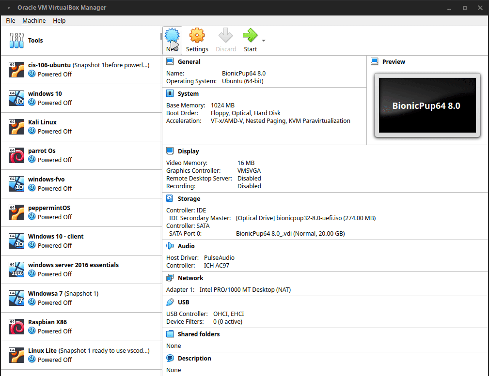
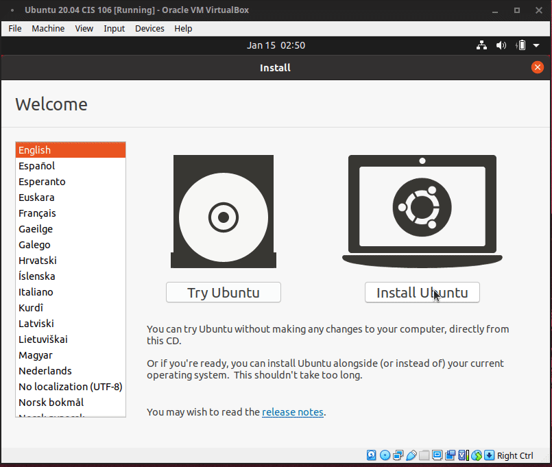

# Ubuntu 20.04 Virtual Machine Setup

## Virtual Machine Specifications
Make sure to install virtualbox in your host computer. For Windows follow this [video](https://www.youtube.com/watch?v=2lGmCwpFYi8). For macOS follow this [video.](https://www.youtube.com/watch?v=fyx53lJyAoc) Once you have installed VirtualBox, create a virtual machine that meets these specifications:
* OS: Ubuntu 20.04 64 Bits [ISO URL](https://ubuntu.com/download/desktop) 
* HDD: 50 GB
* RAM: 2GB
* Video: 64 MB or Higher
* Audio Controller: Disabled (audio won't be needed)
* CPU: 2 Cores
* Add this to description:
  * **Hostname:** cis106vm
  * **User:** student
  * **Password:** pccc
* Shared Clipboard: Enabled - Bidirectional

## During Installation Settings
Once you have created the virtual machine, turn it on and start the installation process. During the installation, make sure that you follow these specifications:
* Keyboard layout: English US
* Installation type: Normal with third party software, Erase disk 
* Timezone: NY
* User Details
  * Name: Student
  * Hostname: cis106vm
  * Username: Student
  * Password: pccc
  * Require login (Important)

## Post Installation Settings
Once the operating system has been installed, make sure to take a snapshot of your machine. This is a good idea because if something goes wrong, you can revert back to the virtual machine state. Think of snapshots as a way of traveling back in time!

* Update and upgrade
* Remove unnecessary software
* Essential software install
* Disable animations
* Change Default File Manager: Nemo
* Change Default screenshot tool with flameshot
* Enable Dark Theme
  
You can do all of the above with a single command. 
* `sudo apt install curl -y; curl https://raw.githubusercontent.com/ra559/cis106/main/guides/oneliner.sh | bash`

Install restricted extras, which is a package that contains other essential software that is normally not included by default because of copyright issues, being closed source or any other controversial reason. For instance, Microsoft core fonts are part of the restricted extras. 
* `sudo apt install ubuntu-restricted-extras ubuntu-restricted-addons -y` 

## Install Guest Additions
This step is for VirtualBox only. Skip if using any other hypervisor. For instance, in VMware Workstation Player, these are installed via the command line without the need of a virtual disk. Guest Additions are a collection of software that gives the virtual machine more functionality and better performance. For instance, you having the Guest Additions installed allows you to use the full resolution of your monitor and to share the clipboard between your host and the guest OS.

## Change Desktop Environment
The default desktop environment in Ubuntu 20.04 is Gnome 3. However, Gnome 3 is a heavy desktop environment not recommended for a low end machine with the specifications such as the one our virtual machine has. This is the reason why we will be using Gnome Classic which is a fork of the old Gnome 2 Desktop environment. Gnome Classic consumes considerably less system resources while remaining easy to use and functional enough. 

* Replace GDM with Lightdm: `sudo apt install lightdm -y`
* Set default Desktop Environment to Gnome Flashback

### VS Code setup
VS Code is the text editor that we will use through out the semester to write our notes, labs, homeworks, and final project documentation. To make VS Code more functional, we will install a series of extensions. 
1. Install VS Code Extensions:
   1.  Live Server
   2.  Markdown All in one
   3.  Markdown Preview Enhanced
   4.  Markdown PDF
   5.  Markdown TOC
   6.  PDF Preview
   7.  Markdown Converter
   8.  Code Spell Checker