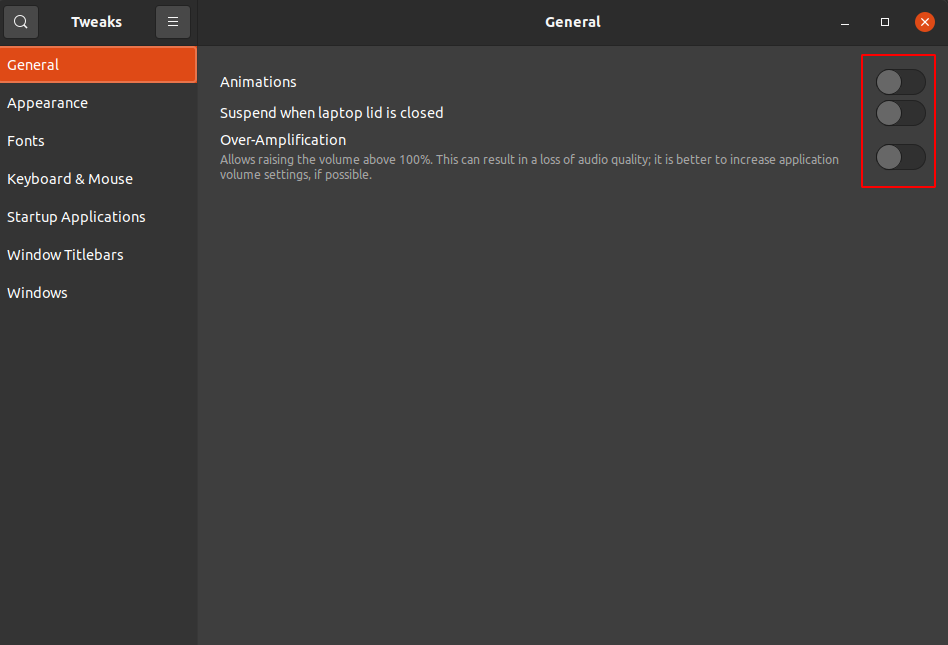

# Ubuntu 20.04 Virtual Machine Setup

## Virtual machine configuration

## Installation

## Setting up Gnome Classic
 * System update: `sudo apt update; sudo apt upgrade -y`
 * Necessary software installation: `sudo apt install gcc make perl nemo ubuntu-restricted-extras ubuntu-restricted-addons git python3-pip flameshot pandoc vlc gnome-tweaks curl snapd flatpak gnome-software-plugin-flatpak gnome-software-plugin-snap wget tree htop net-tools vlc peek vim deluge geany tilix neofetch caffeine gnome-session-flashback -y`
 * Removing unnecessary software: `sudo apt purge apport irqbalance aisleriot gnome-mahjongg gnome-sudoku gnome-mines thunderbird transmission-common  -y`

## VS Code installation and extensions
1. Download deb package from: *https://code.visualstudio.com/sha/download?build=stable&os=linux-deb-arm64*
2. Run this command (assuming that you downloaded the file to your Downloads directory) 
`sudo apt install $HOME/Downloads/code*.deb`
3. Extensions:
   * Live Server
   * Markdown All in one
   * Markdown Preview Enhanced
   * Markdown PDF
   * Markdown TOC
   * PDF Preview
   * Code Spell Checker

## Adding some adjustments
1. Replace nautilus with nemo: `xdg-mime default nemo.desktop inode/directory application/x-gnome-saved-search`

2. Replace Screenshot tool with flameshot:
   

3.  Disable animations
4.  Disable Suspend when laptop lid is closed

5.  Disable desktop icons: `gsettings set org.gnome.gnome-flashback.desktop show-icons false`

6. Set caffeine and flameshot to start with system startup.

7. Enable Dark Theme 
![Dark Theme](../imgs/darktheme.png