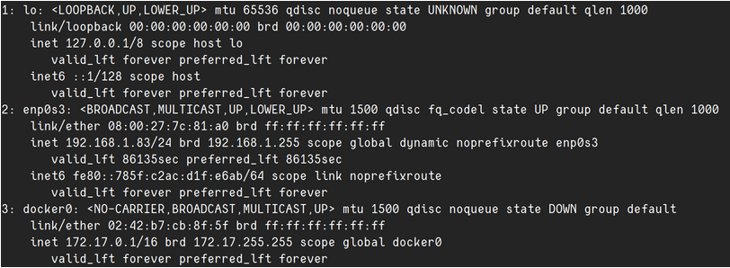

# Lab 5 | Handling Text Files 

The `/etc/passwd` file stores user’s account information. Each account data occupies a single line in a file and when a new account is created a new entry with the new user’s information is added. The `/etc/passwd` records contain several fields, 7 in total. These fields are described in the image below. In this lab, we are going to use the passwd file in combination with the commands for handling text files. The goal is to demonstrate how to use these commands successfully for administering a system. 

 
## Question 1 
Cat, head and tail commands are used for displaying the content of a file.
1. Display the content of the `/etc/passwd` file.
2. Display the content of the `/etc/passwd` file in reverse order.
3. Display the content of the `/etc/passwd` file with line numbers and the $ to indicate the end of every line.
4. Display the first 5 lines of a the `/etc/passwd` file.
5. Display the last 5 lines of the `/etc/passwd` file.

> Take a screenshot of **YOUR TERMINAL ONLY** showing all the commands that you used to complete this question

## Question 2
The cut command is very useful when working with files that are already formatted using a field separator. The cut command can show specific information about each line of text in a given file.

1. Display the first field of the `/etc/passwd` file.
2. Display the last 5 users in the `/etc/passwd` file.
3. Display a list of all the users and their designated login shell separated by an `=` sign.
4. The sort command is another amazing tool in any linux user’s tool box. Sort allows you to display data in a given order. Cut the first and 3rd field of the `/etc/passwd` field and sort the output. 
5. Repeat the previous command but this time only show the last 5 entries.

> Take a screenshot of **YOUR TERMINAL ONLY** showing all the commands that you used to complete this question

## Question 3
The wc command is used to count the number of lines, characters and words in a file.

1. How many lines does the `/etc/passwd` file have?
2. How many words does the `/etc/passwd` file have?

Grep is the holy grail of command line tools. It allows us to search for specific strings inside a file. Here are some examples of the usage of grep: https://robertalberto.com/linuxcommands/commands/grep.html 

3. How many users can login with the `/bin/bash` shell?
4. How many users have the `/sbin/nologin` shell assigned?
5. Display your user’s information in `/etc/passwd` file

> Take a screenshot of **YOUR TERMINAL ONLY** showing all the commands that you used to complete this question

## Question 4

The ip command is used to manage network interfaces. To display the current NICs configuration type: `ip addr` which is short for `ip address`. We are going to use the commands we learned to parse the output of the ip command.

1. Run the `ip addr` command and display all the lines that match the string `inet`. How many lines did you get? 
2. Run the `ip addr` command and display all the lines that match the string `inet6`. Display the output in reverse order.
3. Run the `ip addr` command and display all the lines that match the string `inet` or `inet6` sort the output and save it to a file.
4. Run the `ip addr` command and display only the 3rd line that matches the string `inet`.
5. Run the `ip addr` command and display all the ipv4 addresses sorted.

> Take a screenshot of **YOUR TERMINAL ONLY** showing all the commands that you used to complete this question
