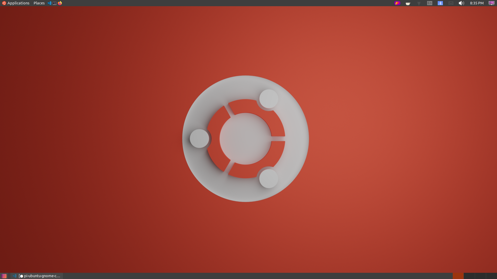
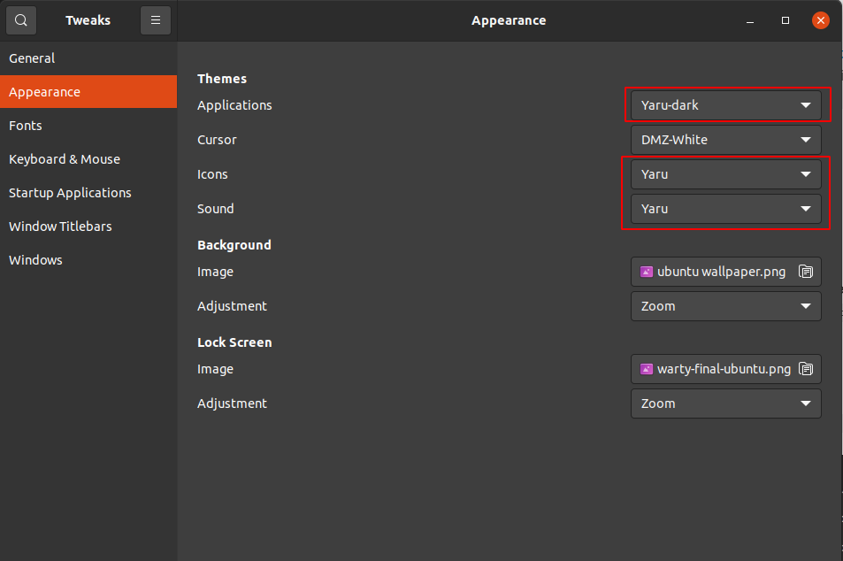
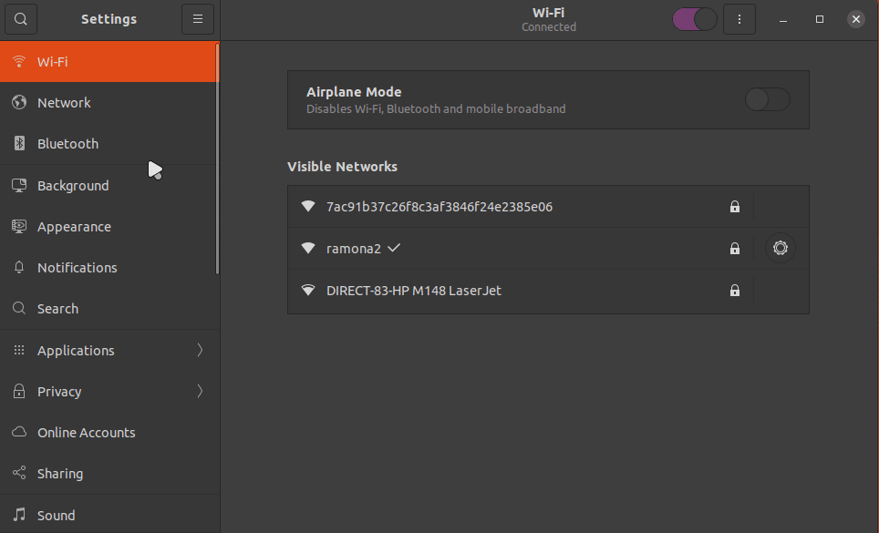
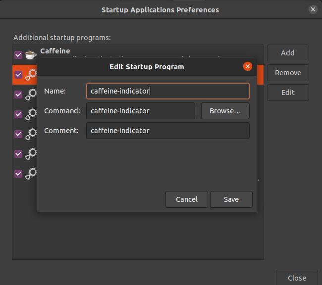

# Raspberry Pi Ubuntu 20.10 Setup **(Gnome Classic Edition)**

## What is Gnome Classic?
GNOME Classic is a feature for users who prefer a more traditional desktop experience. While GNOME Classic is based on GNOME 3 technologies, it provides a number of changes to the user interface, such as the Applications and Places menus on the top bar, and a window list at the bottom of the screen.
[source](https://help.gnome.org/users/gnome-help/stable/gnome-classic.html.en)

## Install Gnome classic
Update the system and install gnome classic: `sudo apt update; sudo apt upgrade -y; sudo apt install gnome-session-flashback -y`

## Add necessary software
`sudo apt install gcc make perl nemo ubuntu-restricted-extras ubuntu-restricted-addons git python3-pip flameshot pandoc vlc gnome-tweaks curl snapd flatpak gnome-software-plugin-flatpak gnome-software-plugin-snap wget tree htop net-tools vlc peek vim deluge geany tilix neofetch midori caffeine -y`

## VS Code:
1. Download deb package from: *https://code.visualstudio.com/sha/download?build=stable&os=linux-deb-arm64*
2. Run this command (assuming that you downloaded the file to your Downloads directory):
`sudo apt install $HOME/Downloads/code*.deb`
3. Install VS Code Extensions:
   1.  Live Server
   2.  Markdown All in one
   3.  Markdown Preview Enhanced
   4.  Markdown PDF
   5.  PDF Preview
   6.  Code Spell Checker

## Remove unnecessary software
Remove error reporting, IRQ Balance, and other not needed software:
`sudo apt purge apport irqbalance aisleriot gnome-mahjongg gnome-sudoku gnome-mines thunderbird transmission-common  -y`

## Enable Dark Theme 

## Adding some adjustments
1. Replace nautilus with nemo: `xdg-mime default nemo.desktop inode/directory application/x-gnome-saved-search`

2. Replace Screenshot tool with flameshot:
   

3.  Disable animations
4.  Disable Suspend when laptop lid is closed

5.  Disable desktop icons: `gsettings set org.gnome.gnome-flashback.desktop show-icons false`

6. Set caffeine and flameshot to start with system startup.

## Extra
:warning: **Before Overclocking the system keep this in mind** :warning:
* Make sure that you are using either a case with a fan or a case with passive cooling if you are using a Raspberry Pi 4
* If you are using a Raspberry Pi 400, you do not have to worry about cooling since it comes with a good heat sink.
* To overclock the system follow these steps:
1. Open the file: `/boot/firmware/config.txt` in a text editor like nano or vim.
2. Add the following lines to the end of the file for the raspberry pi 400:
`force_turbo=1`
`over_voltage=8`
`arm_freq=2200`
3. If you are using a Raspberry Pi 4, add this lines instead:
`over_voltage=6`
`arm_freq=2000`
4. Reboot your Pi with: `sudo reboot` or `telinit 6`

