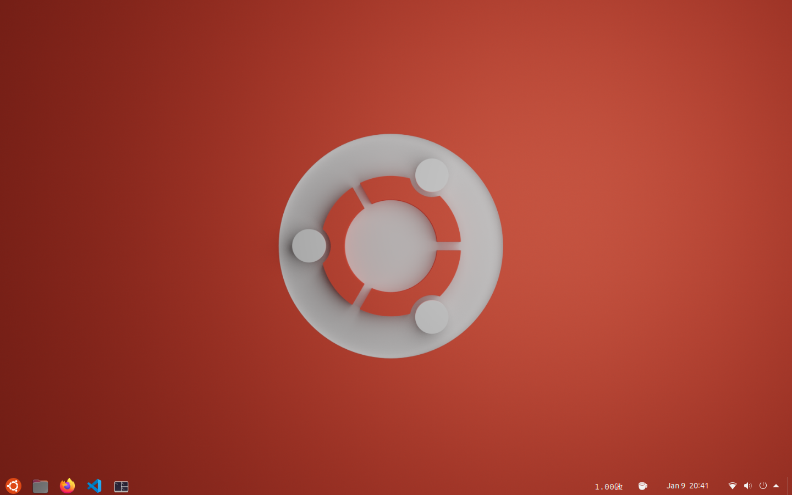

# Raspberry Pi Ubuntu Setup **(Gnome 3 Edition)**:

1. Update the system: 

    `sudo apt update; sudo apt upgrade -y;`

2. Install the necessary software:

    `sudo apt install gcc make perl nemo ubuntu-restricted-extras ubuntu-restricted-addons git python3-pip flameshot pandoc vlc gnome-tweaks curl snapd flatpak gnome-software-plugin-flatpak gnome-software-plugin-snap wget tree htop net-tools vlc peek vim deluge geany tilix neofetch midori -y`

    ## VS Code:
    >Download deb package from: *https://code.visualstudio.com/sha/download?build=stable&os=linux-deb-arm64*
    >2. Run this command (assuming that you downloaded the file to your Downloads directory) 
    >**`sudo apt install $HOME/Downloads/code*.deb`**

3. Remove error reporting, IRQ Balance, and other not needed software:

    `sudo apt purge apport irqbalance aisleriot gnome-mahjongg gnome-sudoku thunderbird transmission-common -y`

4. Enable Gnome Extensions:
   * Go to: https://extensions.gnome.org/ click on `Click here to install Gnome Extensions`. Install the following extensions:
     1. Dash to panel 
     2. caffeine
     3. Blur my shell
     4. cpufeq by konkor
        1. Increase the minimum frequency to 1Ghz
        2. Disable splash screen

5. Disable Animations
   1. Tweaks -> General -> Animations -> Off
   2. Tweaks -> Suspend laptop lid -> Off

6. Turn off desktop icons
   1. Extentions -> Desktop icons -> Off

7. Remove the frequently used program from gnome shell
   
   `gsettings set org.gnome.desktop.privacy remember-app-usage false`

8. Tweak Dash to Panel
   1. Under Position
      1. Replace Applications Button with [Ubuntu logo](https://assets.ubuntu.com/v1/29985a98-ubuntu-logo32.png)
   2. Under Styles
      1. Reduce the panel size to 32
      2. Reduce Icon Margin to 4
      3. Set Icon padding to 2
      4. Enable Panel background opacity
   3. Under Behavior
      1. **Disable:** Show favorite applications on secondary panels
      2. **Disable:** Show window previews on hover
      3. **Enable:** Ungroup applications
         1. set Maximum width to 50
   4. Under Fine-tune:
      1. **Disable:** Animate switching applications and animate launching new windows
   5. Remove all favorite apps and add *Tilix, VS Code, and Firefox, and nemo*
   
9. VS Code Extensions:
   1.  Live Server
   2.  Markdown All in one
   3.  Markdown Preview Enhanced
   4.  Markdown PDF
   5.  PDF Preview
   6.  Code Spell Checker

10. Enable Dark Theme
    1.  Settings -> Appearance -> Dark 

11. Replace Screenshot tool with flameshot:
   

13. Install cursor themes:
    1.  [Materia Light Cursor theme](https://www.gnome-look.org/p/1346778/)
    2.  [Layan](https://www.gnome-look.org/p/1365214/)
    3.  

14. Install icon themes:
    Papirus: `sudo apt install papirus-icon-theme -y`

